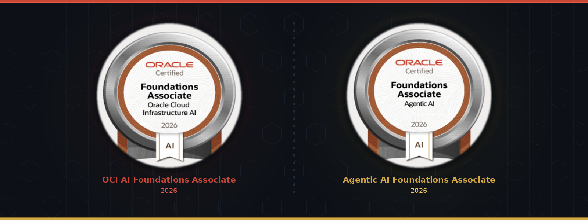

<!-- Animated Header -->

---

## 🚀 About Me

- 🔭 Building projects in **AI/ML, Cloud & Full Stack Development**
- 🏅 **15+ Certifications** across Oracle, AWS, Microsoft, AMD & more
- 🌱 Currently exploring **Generative AI, LLMs, Agentic AI & Cloud Architecture**
- 💬 Ask me about **Python, Machine Learning, OCI, Azure, Prompt Engineering**
- ⚡ Fun fact: Curious creator who loves turning ideas into code

---

## 🛠️ Tech Stack

**Languages**

**AI / ML**

   

**Cloud & DevOps**

**Tools**

---

## 🏅 Certifications

<!-- Upload 'oracle-cert-banner.png' to your repo -->

### ☁️ Cloud & AI Certifications

| Certification | Issuer | Date |
|---|---|---|
| 🔴 Oracle Cloud Infrastructure AI Foundations Associate | Oracle | Aug 2026 |
| 🔴 Agentic AI Certified Foundations Associate | Oracle | Aug 2026 |
| 🔵 Microsoft Certified: Azure Administrator Associate | Microsoft Azure | — |
| 🟠 AWS Foundations of Prompt Engineering | AWS | Aug 2026 |
| 🟠 Introduction to Generative AI - Art of the Possible | AWS | Dec 2025 |

### 🤖 AI & Data Science Certifications

| Certification | Issuer | Date |
|---|---|---|
| 🟣 Central AI Certified Developer | UpSolve | Aug 2026 |
| 🟣 ML Summer School 2026 | Cohere Labs | Aug 2026 |
| 🟣 AI Engineer Certification Complete Bootcamp | Maven | Jun 2026 |
| 🟣 AI-Proof Your Career: 10-Day Upskilling Sprint | Maven | Jun 2026 |
| 🔵 AI Skills Fest 2026 | Microsoft | Jun 2026 |
| 🟢 DataScience+AI | Qualitythought | Mar 2026 |
| 🔴 AMD AI Chatbot | AMD | Mar 2026 |
| 🟣 MCP Fundamentals for Building AI Agents | Educative | Jan 2026 |

### 💼 Industry Simulations

| Certification | Issuer | Date |
|---|---|---|
| 🔵 Wells Fargo - Software Engineering Job Simulation | Forage | Jan 2026 |
| 🔵 JPMorganChase - Software Engineering Job Simulation | Forage | Jan 2026 |

---

## 📊 GitHub Stats

---

## 🏆 GitHub Achievements

---

## 🔥 Featured Projects

### 🧠 31-Day AI Cohort Projects

| Project | Description | Tech |
|---------|------------|------|
| [invoice-extraction-agent](https://github.com/KARTHEEKRAJA/invoice-extraction-agent) | Production-ready invoice extraction agent with LangGraph state machine, arithmetic validation & retry loop | Python, LangGraph, FastAPI, Docker |
| [PageWhispperer](https://github.com/KARTHEEKRAJA/PageWhispperer) | AI-powered document whisperer for intelligent page analysis | Python, AI/ML |
| [AICohortUSA31Days_KR](https://github.com/KARTHEEKRAJA/AICohortUSA31Days_KR) | 31-Day AI Cohort challenge — daily AI/ML projects & learnings | Python, AI |

### 📂 Other Projects

| Project | Description | Tech |
|---------|------------|------|
| [MedicalChatBot](https://github.com/KARTHEEKRAJA/MedicalChatBot) | AI-powered medical chatbot | Python, NLP |
| [ML-DL_Task5](https://github.com/KARTHEEKRAJA/ML-DL_Task5) | Machine Learning & Deep Learning | Jupyter, Python |
| [ShellCompetition](https://github.com/KARTHEEKRAJA/ShellCompetition) | Data Science competition project | Jupyter, Python |

---

*"Stay curious. Keep building."*

